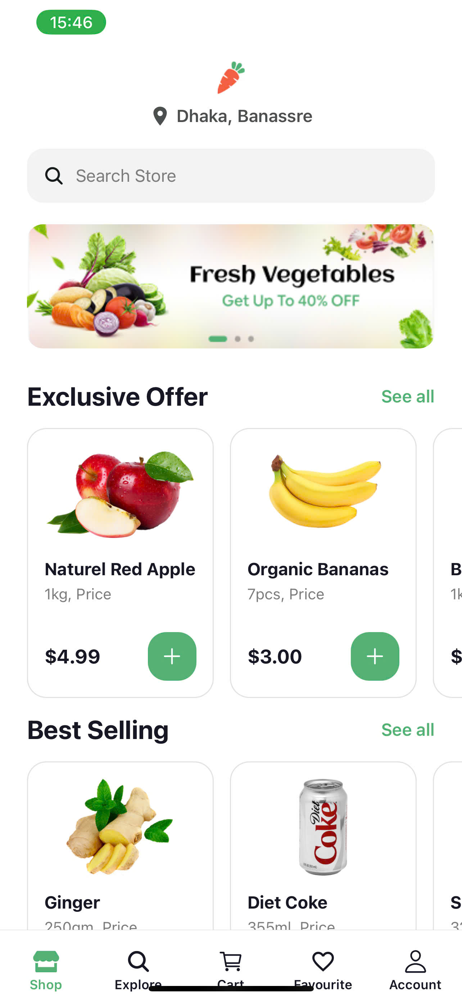
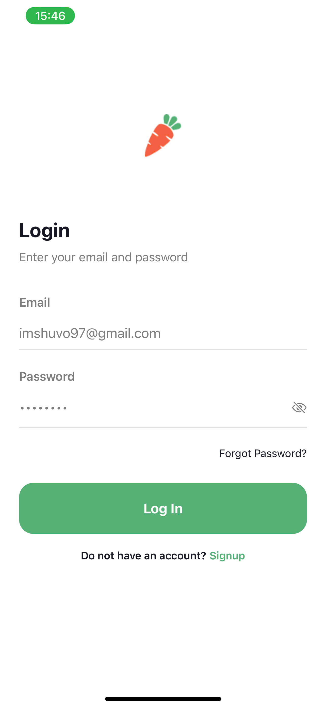
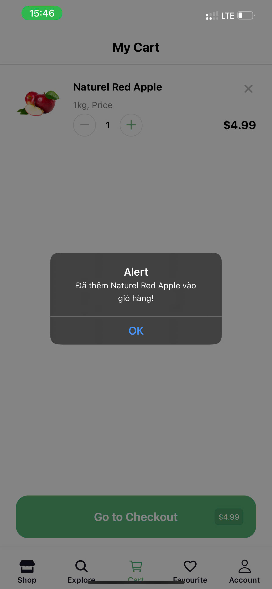
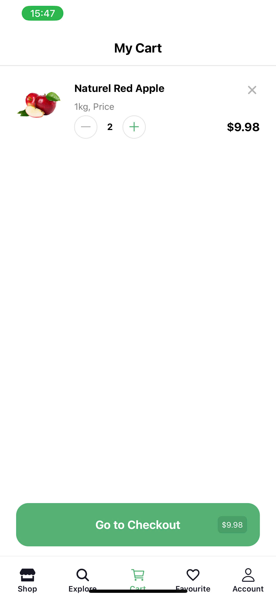
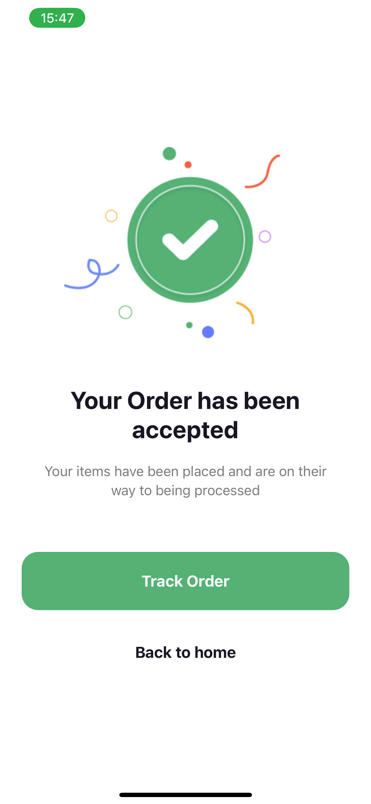
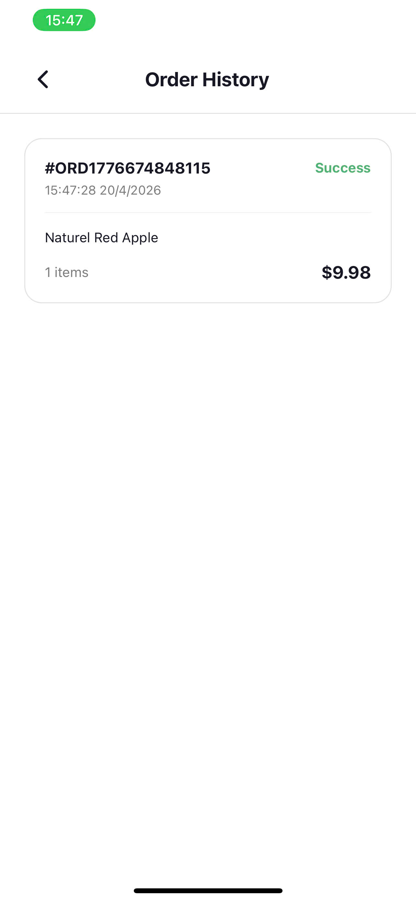

## 1. Thông tin sinh viên

| Thông tin | Chi tiết |
|-----------|----------|
| **Họ và tên** | Nguyễn Ngọc Vinh |
| **Mã số sinh viên (MSSV)** | 23810310427 |
| **Nội Dung** | Hoàn Thành Mobile App Nectar |

---

## 2. Mô tả chức năng

Ứng dụng mua sắm thực phẩm sạch **Nectar Groceries** được xây dựng trên nền tảng **React Native** và **Expo Router**, bao gồm các chức năng chính:

- **Xác thực người dùng:** Đăng nhập, lưu trạng thái đăng nhập tự động qua `AsyncStorage`.
- **Khám phá sản phẩm:** Danh sách sản phẩm động theo danh mục (Fruits, Beverages, Eggs, Meat...), tìm kiếm và lọc sản phẩm theo Brand/Category.
- **Quản lý Giỏ hàng:** Thêm sản phẩm, tăng/giảm số lượng, xóa sản phẩm và tính tổng tiền tự động.
- **Đặt hàng & Lịch sử:** Xử lý Checkout, lưu đơn hàng vào bộ nhớ máy, hiển thị lịch sử đặt hàng.
- **Bảo mật dữ liệu:** Sử dụng Custom Hook `useStorage` kết hợp mã hóa JSON để bảo vệ thông tin người dùng và giỏ hàng lưu dưới máy.

---

## 3. Hướng dẫn chạy App

Để chạy ứng dụng trên máy cá nhân hoặc máy ảo, vui lòng thực hiện các bước sau:

**Bước 1: Cài đặt NodeJS**

Đảm bảo máy đã cài NodeJS phiên bản **18 trở lên**.

**Bước 2: Cài đặt thư viện**

```bash
npm install
```

**Bước 3: Cài đặt Expo Go**

Tải ứng dụng **Expo Go** trên App Store hoặc Google Play.

**Bước 4: Khởi chạy dự án**

```bash
npx expo start
```

**Bước 5: Quét mã QR**

Dùng camera điện thoại quét mã QR hiện trên terminal để mở app.

---

## 4. Ảnh Demo (Minh chứng kết quả)

> 📌 **Ghi chú:** Chụp 9 tấm ảnh và chèn vào thư mục `/assets/screenshots` rồi link vào đây.

### Luồng Xác thực (Ảnh 1–3)
| Ảnh 1 | Ảnh 2 | Ảnh 3 |
|-------|-------|-------|
| Login | Tự động đăng nhập | Log out |
|  |  |  |

### Quản lý Giỏ hàng (Ảnh 4–6)
| Ảnh 4 | Ảnh 5 | Ảnh 6 |
|-------|-------|-------|
| Thêm sản phẩm vào giỏ | Thay đổi số lượng | Lưu giỏ hàng khi tắt app |
|  |  |  |

### Đặt hàng & Lịch sử (Ảnh 7–9)
| Ảnh 7 | Ảnh 8 | Ảnh 9 |
|-------|-------|-------|
| Đặt hàng thành công | Danh sách đơn hàng | Lưu lịch sử đơn hàng |
|  |  |  |

---

## 5. Trả lời câu hỏi kỹ thuật

### Câu 1: `AsyncStorage` hoạt động như thế nào?

`AsyncStorage` là một hệ thống lưu trữ dữ liệu dạng **Key-Value** (Khóa-Giá trị), **bất đồng bộ** (asynchronous) và **bền vững** (persistent).

- Nó lưu dữ liệu trực tiếp vào bộ nhớ flash của thiết bị (Sandboxed storage).
- Dữ liệu chỉ được lưu dưới dạng **Chuỗi (String)**, do đó khi muốn lưu Object hoặc Array, ta phải dùng `JSON.stringify` để đóng gói và `JSON.parse` để giải nén khi đọc.

---

### Câu 2: Vì sao dùng `AsyncStorage` thay vì biến State?

- **Biến State (`useState`):** Chỉ tồn tại trong bộ nhớ RAM khi app đang chạy. Nếu người dùng tắt app hoặc reload (phím `R`), toàn bộ state sẽ bị xóa sạch.
- **`AsyncStorage`:** Lưu dữ liệu xuống ổ cứng của điện thoại. Khi người dùng tắt nguồn, hết pin hoặc tắt app hẳn, dữ liệu vẫn được giữ nguyên. Đây là cách duy nhất để duy trì trạng thái đăng nhập hoặc giỏ hàng cho lần sử dụng sau.

---

### Câu 3: So sánh `AsyncStorage` với Context API?

| Đặc điểm | `AsyncStorage` | Context API |
|----------|----------------|-------------|
| **Mục đích** | Lưu trữ dữ liệu lâu dài trên ổ cứng | Chia sẻ trạng thái giữa các Component (Global State) |
| **Tính bền vững** | Còn nguyên khi tắt/mở lại app | Mất sạch khi app khởi động lại |
| **Tốc độ** | Chậm hơn (vì phải đọc/ghi từ ổ cứng) | Rất nhanh (truy xuất từ RAM) |
| **Kiểu dữ liệu** | Chỉ lưu String (cần JSON) | Lưu được mọi kiểu dữ liệu (Object, Function, Number) |
| **Kết hợp** | Dùng để "nguồn" cấp dữ liệu gốc | Dùng để hiển thị dữ liệu ra giao diện mượt mà |